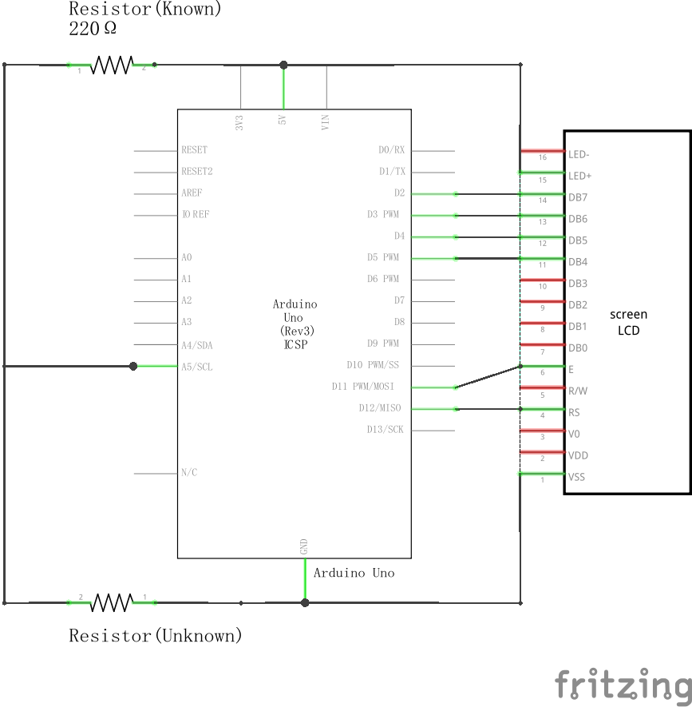
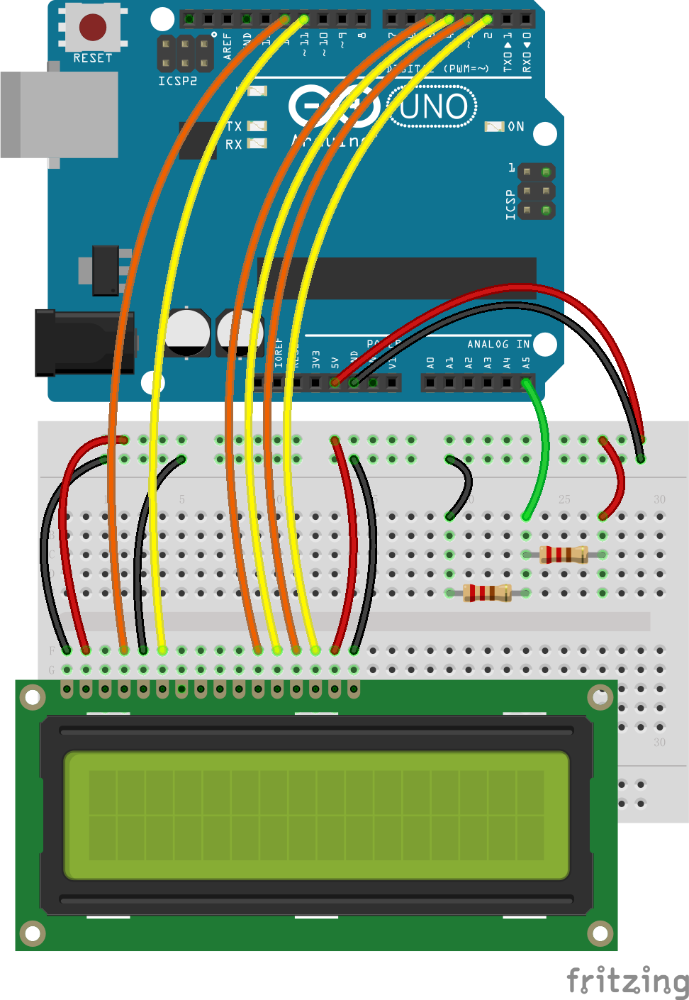

# Embedded Lab - Resistance Identification

## Task
to determine the value of resistors by using analog inputs and digital outputs of an Arduino (and probably a voltage divider). The measurement must be continuous, and the result must be shown on a display (TFT or Nokia or LED-display). Check for extreme values and warn the user via display or beeper when they are reached. Signal if the measurement is ongoing or has ended, and if the values are valid.

## Preparation
### Components
- Arduino Uno   x1
- LCD Screen    x1
- Resistors:
  - 100Ω        x1
  - 150Ω        x1
  - 220Ω        x2
  - 330Ω        x2
  - 680Ω        x2
  - 1kΩ         x1
  - 2.2kΩ       x1

### Schematic Diagram

### Breadboard Connection
