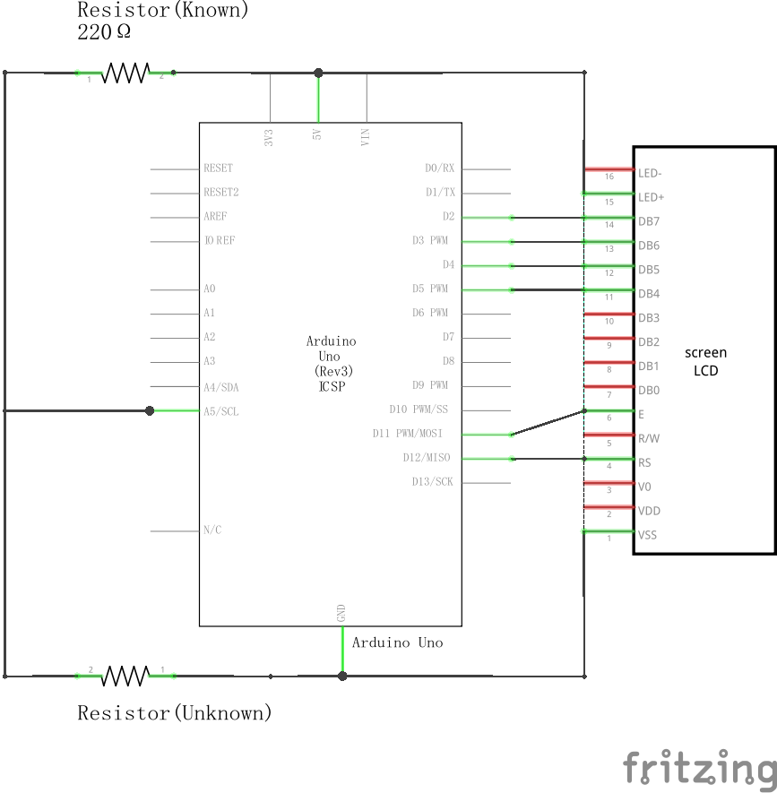
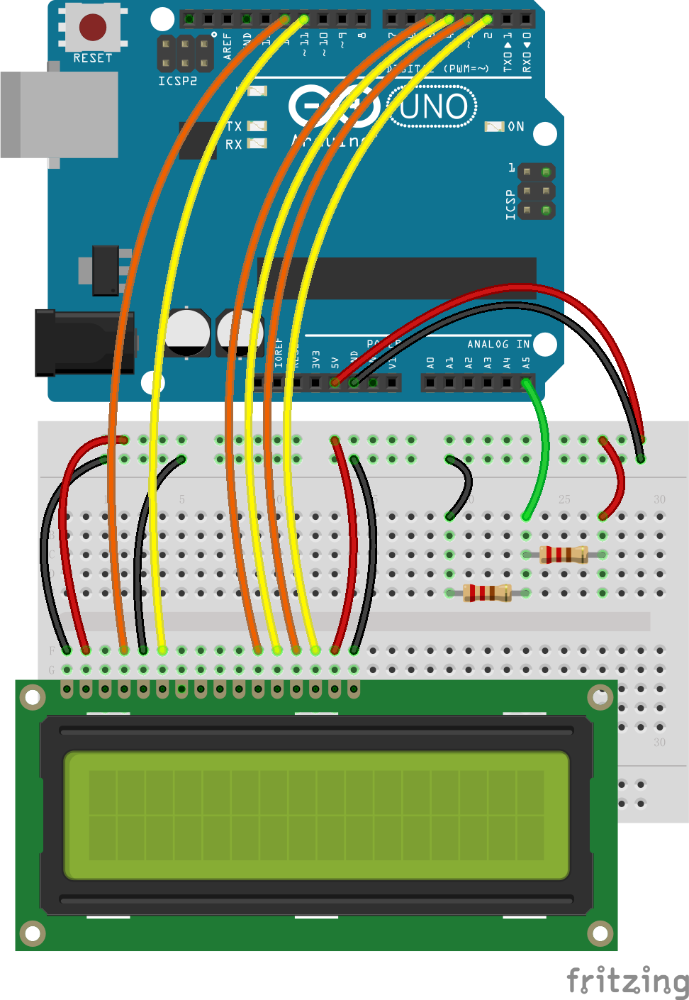
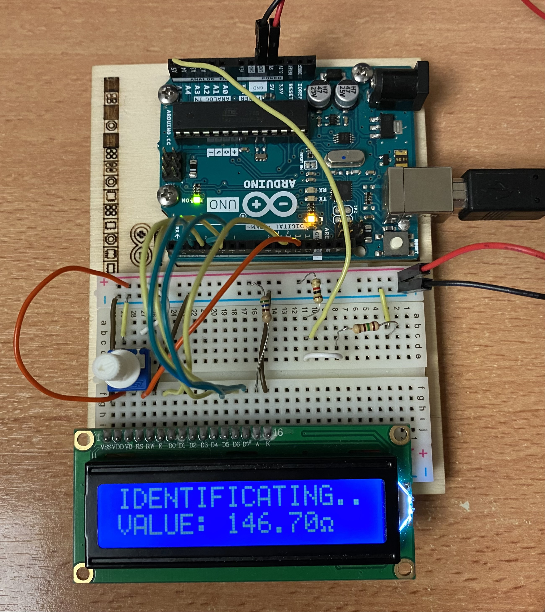
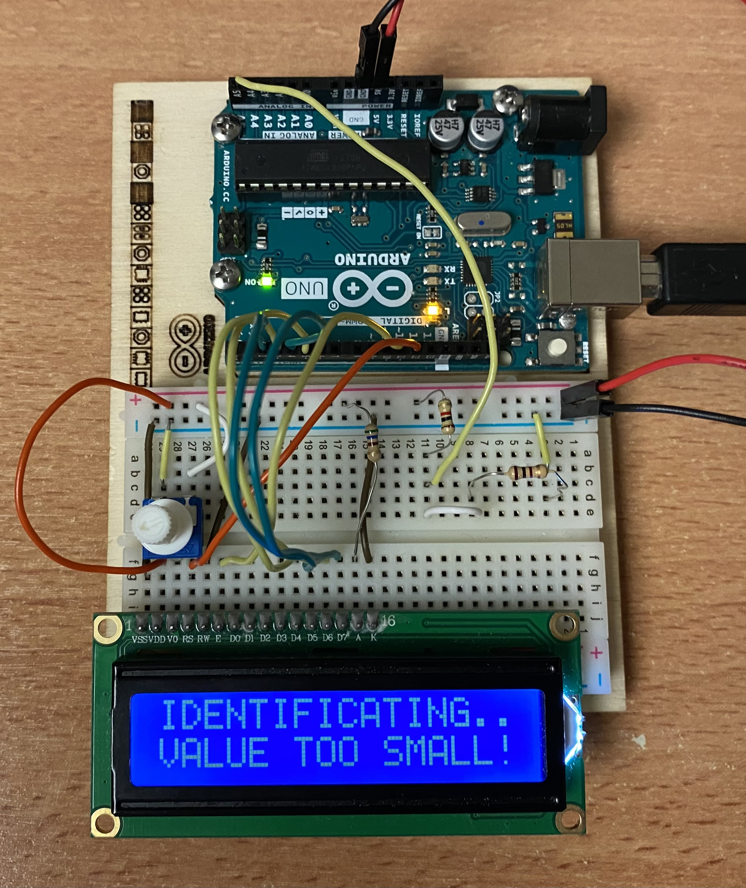
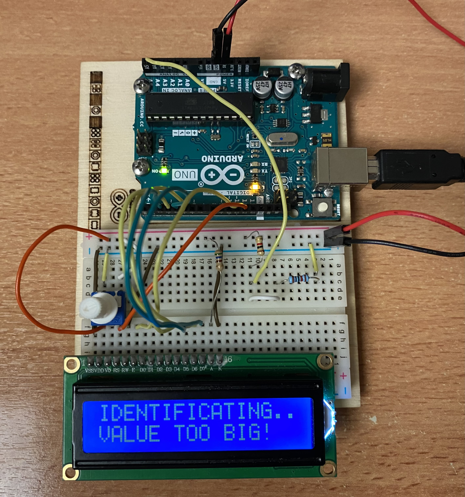
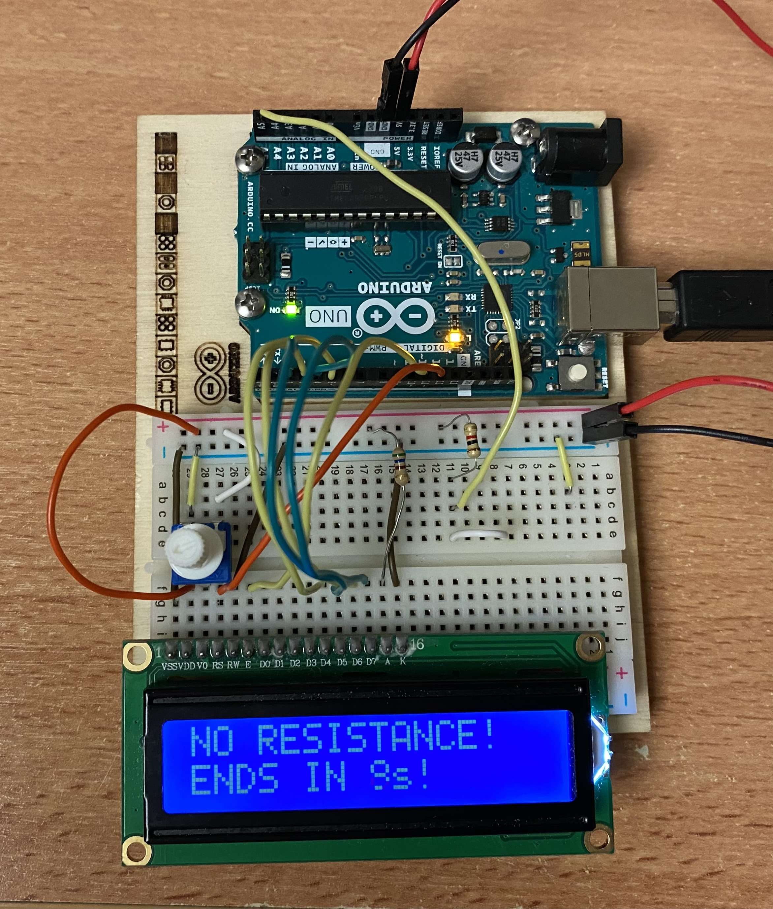
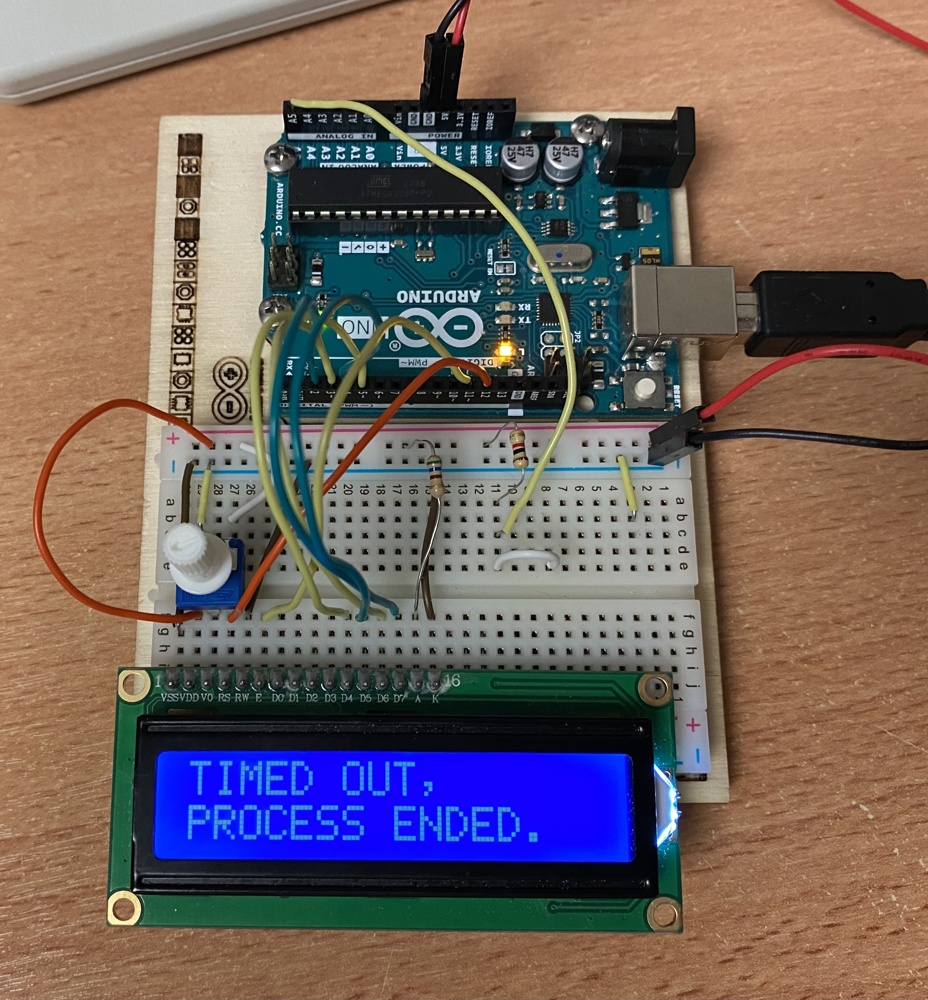

# Embedded Lab - Resistance Identification

## Task
To determine the value of resistors by using analog inputs and digital outputs of an Arduino (and probably a voltage divider). The measurement must be continuous, and the result must be shown on a display (TFT or Nokia or LED-display). Check for extreme values and warn the user via display or beeper when they are reached. Signal if the measurement is ongoing or has ended, and if the values are valid.

## Preparation
### Components
- Arduino Uno   x1
- LCD Screen    x1
- Resistors:
  - 100Ω        x1
  - 150Ω        x1
  - 220Ω        x2
  - 330Ω        x2
  - 680Ω        x2
  - 1kΩ         x1
  - 2.2kΩ       x1

### Schematic Diagram

### Breadboard Connection

## The Ohmmeter
### Functions
- Calculate the unknown resistor by reading electrical signal from Analog Port(here A5) transfer it to digital signal through Arduino and display the resistance calculated value on the LCD.
- Automatically shutdown if no resistor is detected for 10 seconds.
- Indicate if the resistor is too large(> 10\*R1) or too small(< 0.1\*R1).

### configable Variables
Name     | Description
------------------| -------------
R1                | **INT**, **value of the reference resistor**.
MAXTIME           | **INT**, max waiting time before timeout(in millisecond).
DELAYTIME         | **INT**, refresh rate of LCD display(in millisecond).

###  How it works
We learned that the measurement is more accurate if value range of the test resistor should be between one tenth to ten times of the reference resistor R1.

When the ohmmeter is working and the value of test resistor is within the range of (0.1\*R1, 10\*R1).

When the ohmmeter is working but the value of test resistor is smaller than 1/10 of R1.

When the ohmmeter is working but the value of test resistor is bigger than 10 times of R1.

When the ohmmeter is working but cannot detect any resistor to be measured. There is a countdown program. The measurement continues if the resistor is inserted within ten seconds.

If there is no resistor inserted in 10 seconds then the process automatically shuts down.

